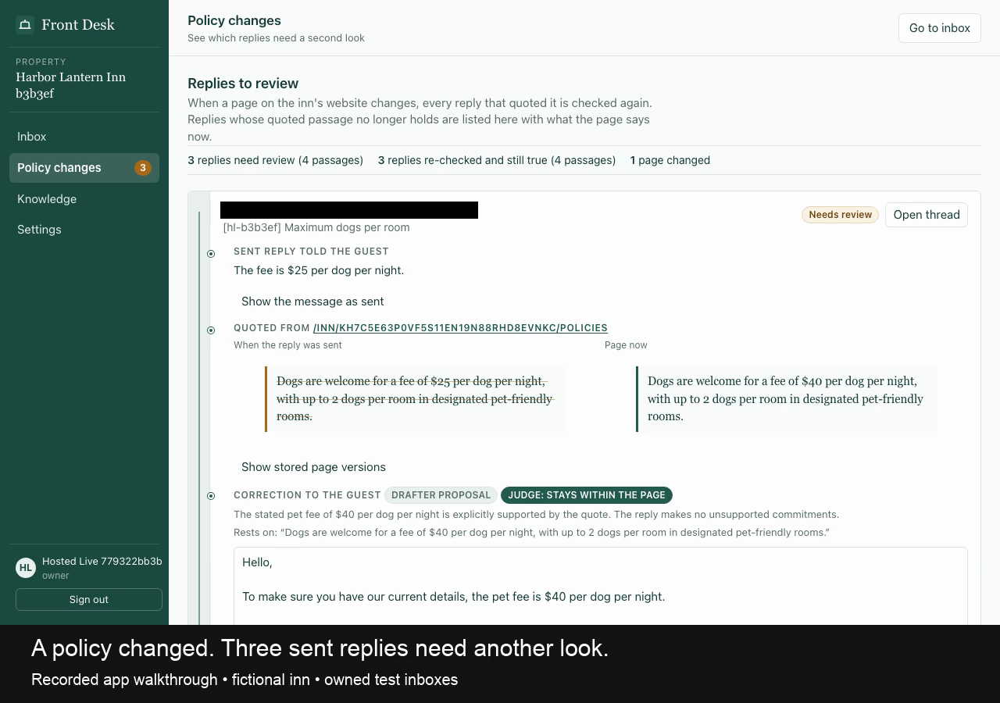

<p align="center">
  
</p>

<h1 align="center">Front Desk</h1>

<p align="center">
  <strong>Answer guest email from the inn's own sources. Know when those sources change.</strong>
</p>

<p align="center">
  A shared email workspace for independent inns. Front Desk drafts grounded
  replies, shows the passage behind every claim, and finds past answers that
  need another look when the website changes.
</p>

<p align="center">
  <a href="#try-it"><strong>Try it</strong></a> ·
  <a href="#using-it"><strong>Using it</strong></a> ·
  <a href="#how-grounded-replies-work"><strong>Grounding</strong></a> ·
  <a href="hackathon.md"><strong>Hackathon log</strong></a>
</p>

<p align="center">
  <a href="https://github.com/kgarg2468/convexonline/actions/workflows/ci.yml"></a>
  <a href="https://outgoing-zebra-720.convex.site"></a>
  
  
</p>

> **Front Desk is a real product built during the Convex All Gas Hackathon.**
> The hackathon set the delivery window, not the product's intended lifetime.
> The public demo uses simulated email; the narrated video uses captures from a
> provider-backed fictional-inn run. [Build and verification record](hackathon.md)

<p align="center">
  <a href="https://outgoing-zebra-720.convex.site/demo.html">
    
  </a>
</p>

## Try it

Open the **[live app](https://outgoing-zebra-720.convex.site)** and choose
**Open the demo workspace**. Every visitor receives a private Harbor Light Inn
workspace with simulated messages and sends, so exploring cannot contact a real
guest.

For the complete story, watch the **[2:30 demo](https://outgoing-zebra-720.convex.site/demo.html)**.
It follows grounded replies, two staff members working together, a website policy
change, correction delivery, and an approved follow-up.

## Using it

1. **Open a thread:** choose a guest from the shared queue. Staff can see who
   else is viewing it and claim responsibility for the reply.
2. **Review the draft:** Front Desk shows the proposed answer beside the exact
   website passages and staff facts that support it.
3. **Edit or send:** unsupported answers stop for staff. Edits are checked again;
   sending always requires a staff action.
4. **Handle a policy change:** run the demo change, then open **Policy changes**
   to compare affected replies with replies that are still supported.
5. **Follow up:** schedule a separate, explicitly approved follow-up. A new guest
   reply, a closed thread, or lost staff access cancels it before delivery.

Nothing is sent merely because a model produced it. Anonymous demo visitors
never receive live-mail authority.

## How grounded replies work

Front Desk captures the inn's public pages and stores each version. When a guest
writes in, the drafting pipeline receives those pages and any staff-added facts.
The draft includes a source and verbatim quote for each factual claim.

Before a draft can be marked ready:

1. the quoted text must exist in the cited source version;
2. the exact answer must remain within what that quote supports; and
3. the draft must still belong to the newest guest message and current sources.

Quote matching is mechanical. A separate model judges entailment only after the
quote passes. Missing information, stale work, approval requests, and unsupported
inferences stay with staff instead of becoming ready-to-send answers.

<details>
<summary><strong>Sending and failure boundaries</strong></summary>

A send first reserves an immutable outbox entry in a Convex transaction. Delivery
rechecks the staff member's access, the claimed thread, the latest guest turn,
the inbox binding, and the source versions immediately before contacting
AgentMail. An ambiguous provider result is recorded as unknown and is not retried
automatically.

Each inn also shares burst and hourly model-operation limits. Incoming mail is
still stored when the model budget is empty; the draft waits for a deliberate
retry instead of creating a background retry loop.

</details>

## When a source changes

Every sent factual claim keeps its source version and quoted passage. After a
page changes, Front Desk checks those claims against the new version.

- Replies whose passage disappeared become correction tasks.
- Replies whose evidence still holds remain visible as re-checked controls.
- A proposed correction is grounded only in the current source.
- Staff approve the final text, and delivery returns to the original guest
  thread through the same guarded outbox.

This is the product's central difference from a generic AI inbox: provenance
continues to matter after the first message is sent.

## Working as a team

Owners invite staff with one-use links. Membership controls every workspace read,
claim, edit, and send. Presence shows who is viewing a thread; a claim lock decides
who may act on it. Removing a member immediately removes access and releases
their claims.

The queue, open thread, drafts, corrections, statistics, and presence update in
realtime. Keyboard navigation supports fast triage, while mobile navigation keeps
the list and open thread as separate screens.

## How Convex fits

Convex is both the application backend and the frontend host.

- **Database and realtime queries:** threads, messages, source versions, drafts,
  citations, corrections, follow-ups, memberships, and live queue state.
- **Transactions and scheduled functions:** claim locks, send reservations,
  approved follow-ups, source refreshes, and stale-work rejection.
- **Convex Auth:** password accounts for staff and isolated anonymous demo
  sessions.
- **Components:** Presence for viewers, Rate Limiter for shared model budgets,
  Aggregate for inbox statistics, AgentMail for durable inbound archives,
  Firecrawl for page capture, and Static Hosting for the React application.

AgentMail carries email, Firecrawl captures public pages, and OpenAI drafts and
judges answers. Provider credentials and calls stay server-side.

## Run locally

Requires a current Node.js release and a Convex account.

```bash
git clone https://github.com/kgarg2468/convexonline.git
cd convexonline
npm install
npx convex dev
```

In a second terminal:

```bash
npm run dev
```

`npx convex dev` creates the local deployment configuration. The interface can
run without live providers, but real drafting, crawling, and email require their
matching server-side OpenAI, Firecrawl, and AgentMail keys. Never put provider
secrets in client-side `VITE_` variables or commit local environment files.

<details>
<summary><strong>Project layout</strong></summary>

| Path | Purpose |
| --- | --- |
| `convex/` | Schema, auth, realtime APIs, generation, delivery, corrections, follow-ups, and scheduled work |
| `convex/lib/` | Source matching, send guards, tenant rules, signatures, parsing, and domain logic |
| `convex/providers/` | Server-side OpenAI, AgentMail, and Firecrawl adapters |
| `src/workspace/` | Inbox, threads, drafts, policy review, knowledge, settings, onboarding, and navigation |
| `src/components/ui/` | Reusable interface primitives |
| `tests/` | Backend, domain, integration, routing, security, and browser coverage |
| `hackathon.md` | Dated public build and verification record |

</details>

## Development

```bash
npm run typecheck  # TypeScript across the app, tests, and Convex
npm run lint       # oxlint
npm test           # Vitest and convex-test
npm run build      # production frontend build
npm run deploy     # Convex backend and static frontend
```

CI runs lint, type checks, the offline test suite, and a production build. The
tests cover tenant isolation, signed webhooks, grounded generation, source
changes, send races, corrections, follow-ups, rate limits, aggregates, presence,
security boundaries, and the anonymous demo.

[Live app](https://outgoing-zebra-720.convex.site) ·
[Demo video](https://outgoing-zebra-720.convex.site/demo.html) ·
[Hackathon build log](hackathon.md) ·
[Source](https://github.com/kgarg2468/convexonline)

## License

No open-source license has been published for Front Desk.
